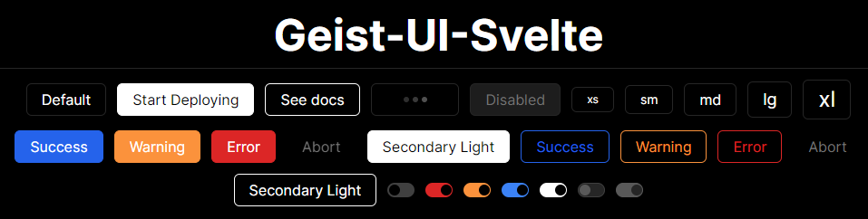

# Geist-UI-Svelte

A UI Library for Svelte built to match Vercel's design inspired by other libraries such as geist-ui.

I started this project on 1/2/2024 in hopes of making it easy to build a Geist themed app in Svelte.

### Quick Start

1. Install geist-ui-svelte and dependencies

```bash
npm install -D tailwindcss postcss autoprefixer geist-ui-svelte
npx tailwindcss init -p
```

2. Configure `tailwind.config.js`

```js
export default {
	content: [
		"./src/**/*.{html,js,svelte,ts}",
		"./node_modules/geist-ui-svelte/**/*.{html,js,svelte,ts}",
	],
	theme: {
		fontFamily: {
			serif: ["JetBrains Mono", "Monospace"],
			sans: ["Inter", "sans-serif"],
		},
		extend: {
			colors: {
				gray: {
					0: "#ffffff",
					50: "#f9f9f9",
					100: "#f2f2f2",
					200: "#d9d9d9",
					300: "#bfbfbf",
					400: "#a6a6a6",
					500: "#8c8c8c",
					600: "#737373",
					700: "#595959",
					800: "#404040",
					900: "#262626",
					925: "#1d1d1d",
					950: "#141414",
					999: "#000000",
				},
			},
		},
	},
	plugins: [],
	darkMode: "class",
};
```

We also recommend you use add this to your CSS

```css
/* Sets scroll bar to dark when in dark mode */
html.dark {
	color-scheme: dark;
}

/* Prevents layout shift when hiding / showing the scrollbar */
html {
	scrollbar-gutter: stable;
}
```

3. Import the components into your project using `geist-ui-svelte/x.svelte`

```html
<script lang="ts">
	import Button from "geist-ui-svelte/Button.svelte";
</script>

<button> Click Me! </button>
```
